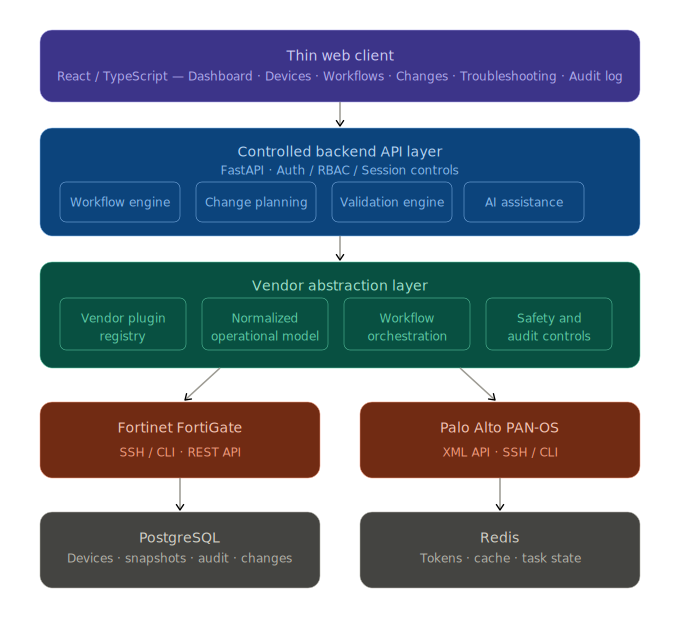
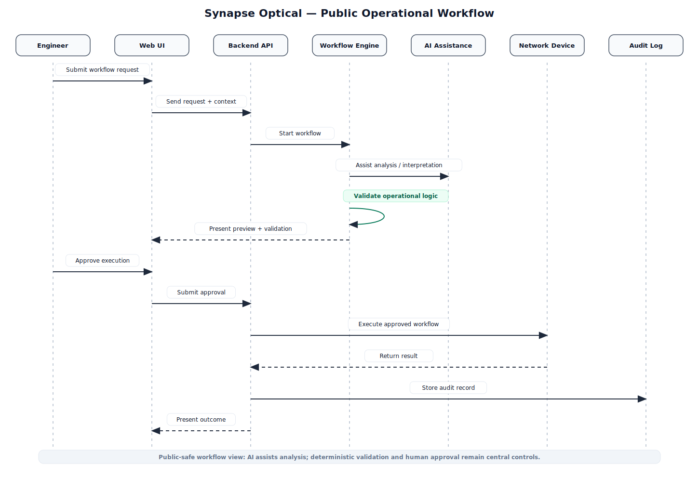
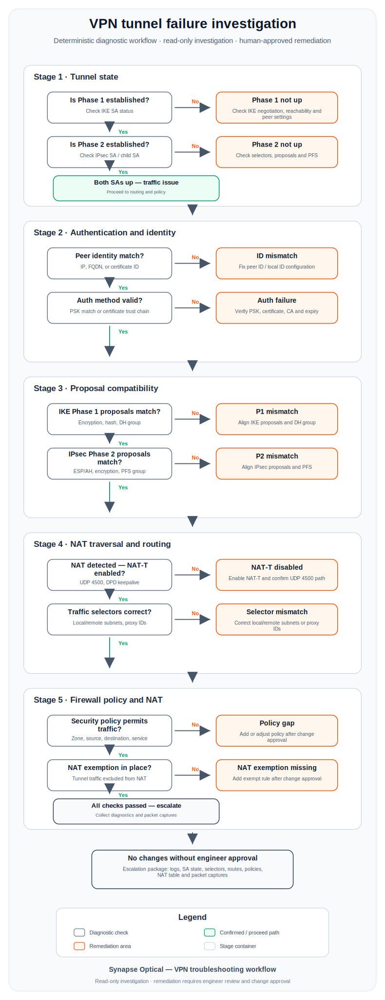

# Synapse Optical

> Built by **Daniel Azgour** — Senior Network Security Engineer specializing in Fortinet, Palo Alto Networks, hybrid cloud networking, and network automation.

Synapse Optical is an AI-assisted network automation and operational troubleshooting platform, born out of a recurring frustration encountered across enterprise environments: **network operations are too slow, too inconsistent, and too dependent on tribal knowledge.**

The platform is designed to improve the speed, consistency, safety, and auditability of enterprise network and security operations — without removing the engineer from the equation.

> **Status:** Active proof-of-concept under ongoing development. This repository contains architecture documentation, design philosophy, workflow concepts, and sanitized examples. Core proprietary source code and backend systems are intentionally excluded.



---

## Why I Built This

After years of working in enterprise network and security operations — migrations, VPN deployments, firewall management, hybrid cloud connectivity — the same problems kept appearing:

- Troubleshooting workflows lived in engineers' heads, not in systems
- Configuration changes lacked repeatable validation steps
- Vendor-specific quirks caused preventable outages
- Audit trails were inconsistent or absent

Synapse Optical is my attempt to systematically address those gaps with a platform that combines **deterministic operational logic**, **vendor-aware intelligence**, and **AI-assisted reasoning** — with human oversight built in from the ground up.

---

## What Synapse Optical Is Not

This platform is **not** an autonomous AI that directly configures production infrastructure without oversight.

Every production-impacting action is gated behind deterministic validation, structured workflow execution, and explicit human approval. AI accelerates and assists — it does not replace engineering judgment.

---

## Architecture Philosophy

### Deterministic First

Deterministic validation and operational logic take priority over AI-generated assumptions. Structured workflows and validation engines are designed to provide **predictable, repeatable, and auditable** operational outcomes before any production-impacting action is executed.

AI is layered on top of a deterministic foundation — not substituted for one.

### AI as an Operational Enhancement Layer

AI functionality assists engineers by:

- Accelerating troubleshooting and diagnostic interpretation
- Improving operational visibility and workflow interaction
- Summarizing operational findings in plain language
- Surfacing relevant vendor-specific context during analysis

### Human Approval and Operational Safety

Operational safety is a primary architectural constraint, not an afterthought. Every workflow follows a structured execution model — with an explicit human approval gate before any production-impacting action is executed.



### Vendor-Aware Intelligence

Operational workflows adapt to:

- Vendor platform and OS version
- Licensing constraints
- Supported configuration capabilities
- Cryptographic support limitations
- Vendor-specific operational behavior

This reduces unsupported or unsafe configuration generation across heterogeneous environments.

---

## Technical Architecture (High Level)

Synapse Optical uses a **thin-client / controlled-backend architecture** designed around operational safety, deterministic validation, vendor-aware workflow orchestration, and auditability. Full architecture documentation is available in the [`architecture/`](./architecture/) directory.

---

## Current PoC Focus Areas

- Fortinet operational workflows (FortiGate, FortiManager, FortiAnalyzer)
- IPsec VPN troubleshooting engines (Phase 1 / Phase 2, DPD, NAT-T, selectors)
- Firewall policy and configuration validation
- Guided deterministic operational workflows
- Vendor-aware operational safety checks
- AI-assisted troubleshooting analysis
- Change preview and rollback planning concepts

---

## Active Development

- Vendor abstraction architecture
- Palo Alto Networks PAN-OS integration
- Workflow orchestration engine
- VPN commissioning workflows
- Policy validation logic
- Structured audit workflows

---

## Multi-Vendor Roadmap

| Platform | Status |
|---|---|
| Fortinet FortiGate | ✅ Current focus |
| Palo Alto Networks PAN-OS | ✅ Current focus |
| Cisco ASA | 📋 Planned |
| Check Point Gaia | 📋 Planned |
| Juniper Junos OS | 📋 Planned |
| FortiAnalyzer | 📋 Planned |
| Cisco IOS / IOS-XE / NX-OS | 📋 Planned |
| Hybrid cloud networking (AWS) | 📋 Planned |

---

## Functional Areas

### VPN Troubleshooting
IPsec Phase 1 and Phase 2 analysis, DPD and NAT-T diagnostics, routing and selector validation, authentication and peer ID troubleshooting, tunnel state verification, vendor-aware VPN workflows.



### Firewall Operations
Policy analysis, address object management, interface configuration workflows, NAT validation, security policy consistency checks, deterministic validation workflows.

### Migration Assistance
Pre-change operational checks, post-change verification workflows, rollback planning concepts, multi-vendor configuration comparison.

### Hybrid Cloud Connectivity
AWS hybrid networking concepts, VPN connectivity validation, routing and segmentation analysis, secure connectivity workflow development.

---

## Repository Structure

```text
README.md

architecture/
├── high-level-architecture.md
├── operational-workflow.md
├── vendor-abstraction.md
├── safety-model.md
├── roadmap.md
├── why-deterministic-first-matters.md

troubleshooting/
workflows/
diagrams/
screenshots/
```

> Core proprietary source code, orchestration logic, internal AI workflows, backend systems, and execution pipelines are intentionally excluded from this public repository.

---

## Disclaimer

All configurations, examples, diagrams, screenshots, and workflows in this repository are sanitized and intended for demonstration, educational, and architectural showcase purposes only. No customer environments, credentials, proprietary client data, or production-sensitive information are included.

---

## Author

**Daniel Azgour**  
Senior Network Security Engineer  
Fortinet · Palo Alto Networks · Hybrid Cloud Networking · Network Automation · Operational Security Engineering
