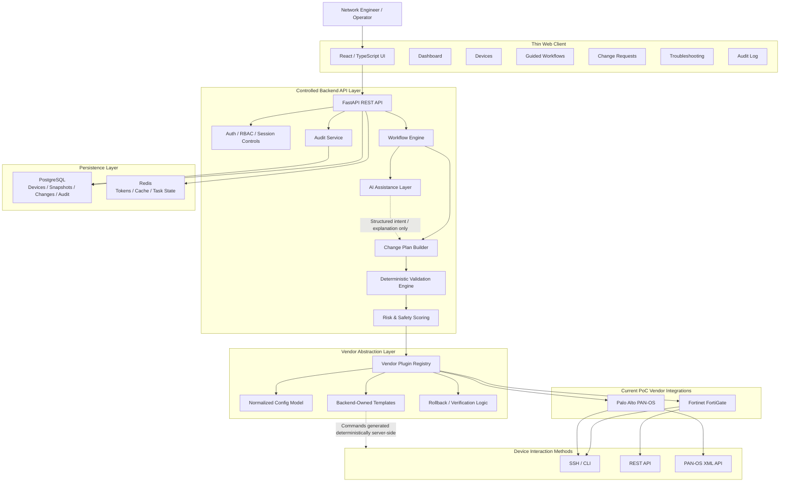

# Synapse Optical — High-Level Architecture

This diagram represents the current proof-of-concept direction for Synapse Optical. It shows the intended platform structure for AI-assisted network automation, deterministic troubleshooting, vendor-aware validation, and controlled operational workflows.

## Architecture Notes

Synapse Optical is designed around a **deterministic-first operational model**. Structured diagnostic and validation logic is intended to perform predictable checks before AI-generated explanation or assistance is applied.

The AI layer is positioned as an **assistance and explanation layer**, not as an unchecked decision-maker. Its role is to help summarize findings, explain diagnostic results, assist with workflow interaction, and improve engineer efficiency.

The vendor abstraction layer is intended to normalize operational workflows across different platforms while still respecting vendor-specific capabilities, syntax, APIs, licensing constraints, and platform behavior.

Current proof-of-concept focus is on:

- Fortinet FortiGate
- Palo Alto Networks PAN-OS
- SSH-based device interaction
- REST / XML API-based device interaction
- VPN diagnostics
- Configuration validation
- Change preview and approval concepts

## Current Scope

This diagram reflects both current proof-of-concept functionality and planned architectural direction. It is intentionally high-level and does not expose proprietary implementation logic, backend orchestration code, internal prompts, credentials, or production-sensitive design details.
