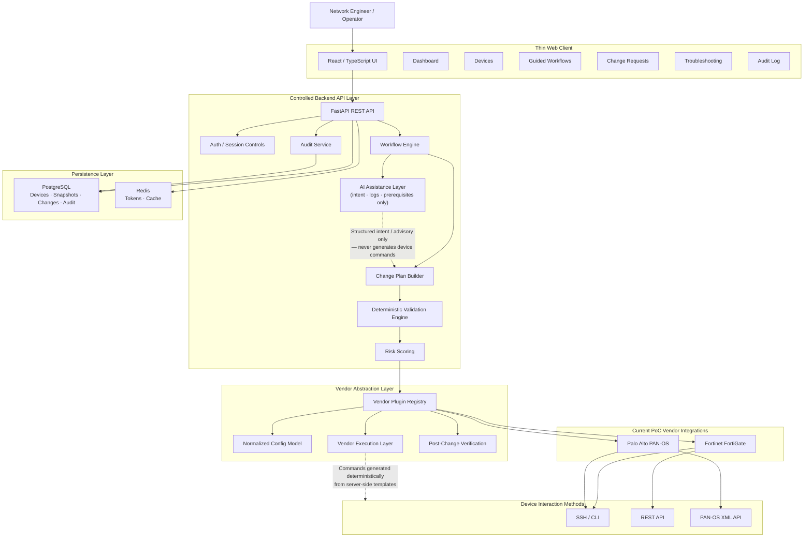

# Synapse Optical — High-Level Architecture

This document describes the current proof-of-concept architecture for Synapse Optical. It covers the platform's structural design, component responsibilities, change lifecycle, AI scope, and vendor integration model.

> **Status:** Active proof-of-concept. Architecture reflects current implementation direction. Some components noted below are under active development or planned for a future production promotion phase.

---

## Architecture Principles

The platform is built around six core principles that govern every design decision:

1. **Deterministic-first.** Structured validation, change planning, and command generation are handled by deterministic backend systems. The LLM is used in a strictly bounded assistance role — it never generates device commands.
2. **Human approval before execution.** Every production-impacting change requires explicit operator approval before any execution begins. No autonomous changes.
3. **Audit-first.** Every state-mutating action produces an immutable audit record. Traceability is a first-class requirement, not an afterthought.
4. **Vendor-aware.** Operational workflows adapt to vendor platform, OS version, and supported capabilities. Platform differences are respected, not hidden.
5. **AI as an assistance layer.** The LLM assists with intent interpretation, log analysis, and workflow prerequisite checks. It does not control execution, generate commands, or make operational decisions independently.
6. **Designed for production promotion.** The PoC is built with multi-tenancy scaffolding in place (`tenant_id` on every table, JWT-based auth) so the path to commercial SaaS is incremental rather than a rewrite.

---

## Platform Overview

Synapse Optical is a thin-client / controlled-backend platform for AI-assisted network and firewall operations. The frontend contains zero vendor or AI logic — it exclusively calls the backend API. All intelligence, vendor interaction, change planning, validation, and execution reside in the backend.

The platform supports two categories of operation:

- **Read-only diagnostics** — VPN diagnostics, policy analysis, log analysis, configuration snapshots, topology discovery. No approval gate required.
- **Change-capable workflows** — Interface configuration, VPN commissioning, NAT, routing, address objects, and similar. Full change lifecycle with mandatory human approval applies.

---

## Component Overview

### Thin Web Client
A React / TypeScript single-page application. Handles authentication, workflow interaction, change review and approval, and audit log presentation. Contains no vendor logic, AI logic, or command generation of any kind.

### Backend API Layer
A FastAPI application that owns all platform intelligence. Responsibilities include authentication and session management, workflow orchestration, change plan construction, deterministic validation, risk scoring, vendor plugin dispatch, AI orchestration, and audit logging. The backend is the sole component that communicates with network devices.

### Workflow Engine
Orchestrates guided operational workflows (VPN commissioning, interface configuration, routing protocol templates, and others). Workflows follow the deterministic path: form inputs are validated, a structured change plan is built from templates, and the result enters the standard approval pipeline. AI is not involved in the deterministic workflow path.

### Change Plan Builder
Constructs vendor-specific change plans from validated workflow inputs. All device commands are generated by deterministic server-side templates — the LLM never contributes to command generation.

### Deterministic Validation Engine
Validates prerequisites, dependency relationships, cryptographic compatibility, object conflicts, and operational safety conditions before any change plan is presented for approval.

### Risk Scoring
Evaluates change plans against declarative risk pattern rules (`risk_patterns.yaml` per vendor) and attaches a risk score to every change before human review. Risk score is surfaced as a float (0.0–1.0) in the change preview. A structured `RiskAssessment` schema with tier classification is in active development.

### AI Assistance Layer
The LLM is called in exactly three contexts:

| Context | Input | Output | Notes |
|---|---|---|---|
| Intent parsing | Natural language request + normalized config summary | Structured `ParsedIntent` (action enum + parameters) | Temperature 0.0. LLM never outputs CLI commands. |
| Log analysis | Up to 200 deny/drop log entries + operator query | Summary, responsible rule, recommended actions, change hint | Change hint requires manual operator action — never auto-submitted. |
| Workflow prerequisites | Normalized config summary + workflow type | Advisory warnings + suggested checks | Advisory only. Never blocks workflow execution. |

The LLM is bypassed entirely on the deterministic path (guided workflows and BAU templates), which represents the majority of platform operations.

### Vendor Execution Layer
Handles vendor-specific command generation, execution, and post-change verification. FortiGate uses a dual-transport model (REST API primary, SSH fallback). PAN-OS uses the XML API with a candidate-config lifecycle (lock → stage → validate → commit). All commands originate from server-side templates — never from the LLM.

### Vendor Plugin Registry
A plugin registry that normalizes operational behavior across supported vendors. Each plugin implements a common interface: connection testing, config retrieval and parsing, change plan execution, post-change verification, and rollback support. Currently registered: `fortigate`, `paloalto_panos`.

### Normalized Config Model
A vendor-agnostic config representation populated by each vendor's parser. Shared by the validation engine, AI layer, risk scorer, and workflow engine. PAN-OS-specific fields use default factories so FortiGate code paths are unaffected.

### Post-Change Verification
A first-class lifecycle stage, not an optional check. After execution completes, each change step's verification commands are re-run against the live device. Results are stored as a structured `VerificationResult` on the change record. A `verifying → failed` transition triggers automatic rollback where supported.

### Audit Service
Records every state-mutating action with operator attribution, timestamps, and change context. Stored in PostgreSQL. Immutable by design.

---

## Architecture Diagram



---

## Change Lifecycle

Every change-capable operation follows a mandatory lifecycle. No step can be skipped.

```
pending_review → approved → executing → verifying → completed
               ↘ rejected
                             ↘ failed → rolled_back
```

| Stage | Description |
|---|---|
| `pending_review` | Change plan generated, risk score attached, awaiting operator review |
| `approved` | Operator explicitly approved; execution may begin |
| `executing` | Vendor commands being applied to the device |
| `verifying` | Post-execution verification commands re-run against live device |
| `completed` | All verification checks passed; change confirmed live |
| `rejected` | Operator rejected at review; no execution occurred |
| `failed` | Execution or verification failed; rollback initiated |
| `rolled_back` | Rollback completed; device returned to pre-change state |

### Two entry paths

| Path | Description | AI involved? |
|---|---|---|
| Natural language | Operator submits a free-text request → LLM parses intent into a structured `ParsedIntent` → deterministic templates build the change plan | Yes — intent parsing only |
| Deterministic | Guided workflows and BAU templates → form inputs validated → change plan built directly from templates | No |

Both paths land in `pending_review` and follow the identical approval pipeline from that point forward.

---

## AI Role and Scope

Synapse Optical is not an AI-driven platform. It is a deterministic platform with AI assistance in specific, bounded contexts.

The LLM:
- **Is used for:** parsing natural language intent, summarising log analysis findings, and generating advisory prerequisite warnings for guided workflows
- **Is not used for:** generating device commands, making execution decisions, controlling workflow sequencing, or any operation on the deterministic path

All device commands originate from server-side templates. The LLM operates at temperature 0.0 for intent parsing. Its outputs are structured JSON — never raw CLI or API syntax. On the deterministic workflow path, the LLM is not invoked at all.

---

## Vendor Integration Model

### Supported platforms (current PoC)

| Platform | Transport | Status |
|---|---|---|
| Fortinet FortiGate (FortiOS 7.2.x, 7.4.x, 7.6.x) | REST API (primary) · SSH/CLI (fallback) | ✅ Active |
| Palo Alto Networks PAN-OS 11.2.x | XML API · SSH/CLI (operational commands) | ✅ Active |

### Transport design

FortiGate uses a dual-transport model: the platform attempts REST API execution first and falls back to SSH for operations not yet covered by the REST payload layer. This allows incremental REST adoption without losing capability.

PAN-OS uses the XML API candidate-config lifecycle exclusively for configuration changes: acquire lock → stage changes → validate candidate → commit. SSH is used for operational commands (VPN diagnostics, routing table queries) that require CLI output.

### Vendor abstraction

Each vendor is implemented as a plugin conforming to a common `VendorPlugin` interface. Adding a new vendor requires only: a sanitized config fixture, a plugin module implementing the interface, and a registry entry. No changes to the core API, workflow engine, or validation logic are required.

---

## Persistence Layer

| Store | Purpose |
|---|---|
| PostgreSQL 16 | Devices, config snapshots, change records, audit logs, topology relationships |
| Redis 7 | JWT refresh tokens, token blacklist, response cache |

All database models carry `tenant_id` for future row-level security enforcement. The PoC operates single-tenant with this scaffolding already in place.

---

## Current Scope and Deployment

**Deployment model:** Single-user, single-tenant local PoC running under Docker Compose. Designed for clean promotion to a multi-tenant SaaS architecture — multi-tenancy scaffolding, JWT infrastructure, and vendor plugin extensibility are present in the current codebase.

**Current PoC focus areas:**
- Fortinet FortiGate operational workflows
- Palo Alto Networks PAN-OS integration (configuration management, diagnostics, VPN)
- IPsec VPN troubleshooting and commissioning
- Firewall policy and configuration validation
- Interface, routing, NAT, and address object templates
- Guided deterministic workflows with change preview and approval
- Device topology discovery and cross-device diagnostics
- AI-assisted log analysis and workflow prerequisite checks

**Planned expansion:**
- Cisco ASA, Cisco Firepower/FTD, Check Point Gaia, Juniper Junos OS
- Hybrid cloud networking (longer-term directional — no current codebase scope)
- Multi-tenant RBAC and workflow approvals
- Async execution pipeline (Celery)
- Expanded REST API coverage (FortiGate)
- Structured risk assessment schema and tier classification

---

## Public Repository Scope

This document intentionally excludes:

- Proprietary orchestration and workflow logic
- Internal AI prompt systems and schema detail
- Backend template implementation
- Vendor command generation specifics
- Credential handling and TLS configuration
- Production deployment architecture
- Implementation-specific intellectual property

The repository is intended to showcase architectural direction, operational methodology, and engineering approach only.

