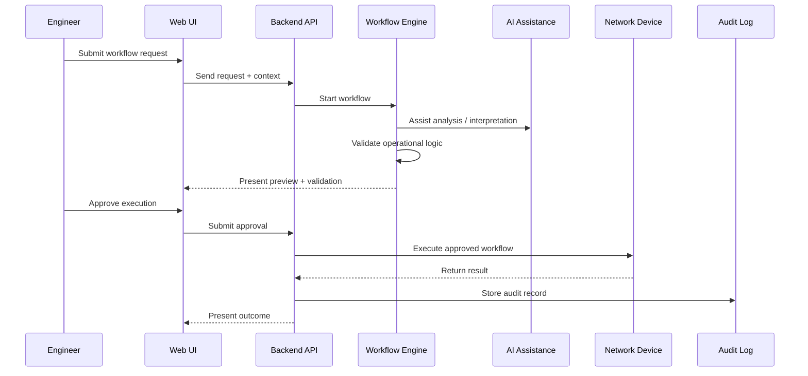

# Synapse Optical — Operational Workflow Model

## Overview

Synapse Optical is being designed around deterministic operational workflows, vendor-aware validation, human approval, and audit-first execution principles.

Operational workflows are intended to assist engineers by providing structured validation, guided execution, troubleshooting assistance, and operational visibility while maintaining human oversight.

The workflow model emphasizes:

- deterministic validation before execution
- AI-assisted operational analysis
- human approval for production-impacting actions
- vendor-aware operational behavior
- auditability and operational traceability

---

## Public Operational Workflow

---

## Workflow Philosophy

The operational workflow model is intended to balance automation efficiency with operational safety.

AI functionality is designed to assist with analysis, workflow interaction, troubleshooting guidance, and operational interpretation, while deterministic validation and human approval remain central operational controls.

Workflows are intended to provide predictable, auditable, and vendor-aware operational behavior across supported infrastructure platforms.

---

## Public Repository Scope

This documentation intentionally excludes:

- proprietary orchestration logic
- backend execution implementation
- internal AI prompts
- vendor command generation systems
- production deployment architecture
- implementation-specific intellectual property

Public documentation is intended to showcase architectural direction, operational methodology, workflow philosophy, and engineering approach only.
