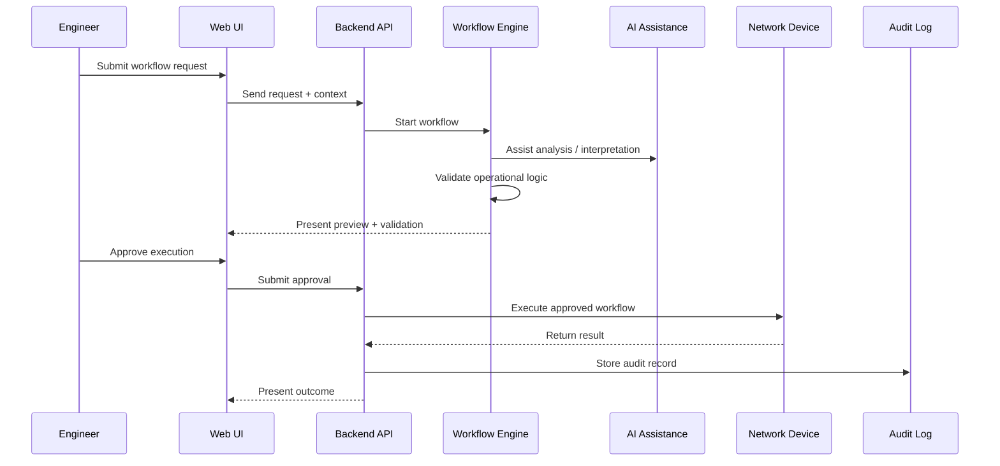

# Synapse Optical — Operational Workflow Model

## Overview

Synapse Optical is being designed around deterministic operational workflows, vendor-aware validation, human approval, and audit-first execution principles.

Operational workflows are intended to assist engineers by providing structured validation, guided execution, troubleshooting assistance, and operational visibility while maintaining human oversight.

The workflow model emphasizes:

- deterministic validation before execution
- AI-assisted operational analysis
- human approval for production-impacting actions
- vendor-aware operational behavior
- auditability and operational traceability

---

## Public Operational Workflow

