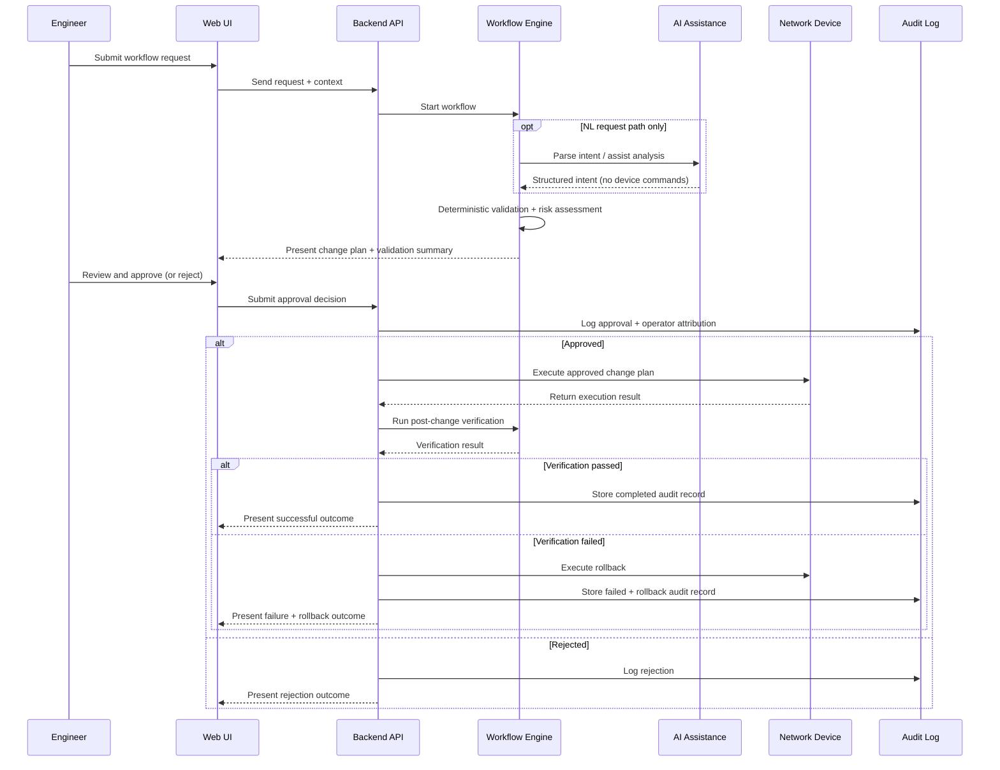

# Synapse Optical — Operational Workflow Model

## Overview

Synapse Optical is designed around deterministic operational workflows, vendor-aware validation,
human approval, and audit-first execution principles.

Operational workflows assist engineers by providing structured validation, guided execution,
troubleshooting assistance, and operational visibility — while keeping human oversight central
to every production-impacting action.

The workflow model is built on five principles:

- **Deterministic validation before execution** — prerequisite checks, dependency analysis, and
  vendor compatibility validation run before any change is approved or executed
- **Template-driven command generation** — device commands are produced by deterministic,
  vendor-aware backend templates; AI output never reaches device execution
- **Human approval as an execution gate** — no production-impacting action executes without
  explicit operator approval; approval cannot be bypassed
- **Post-change verification** — after execution, the platform re-validates the change outcome
  before marking it complete; failures trigger rollback
- **Auditability and operational traceability** — every state transition is logged with operator
  attribution, timestamps, and execution evidence

---

## Workflow Classification

Every operation in Synapse Optical is classified before implementation. This classification
determines which lifecycle controls apply.

### READ_ONLY

Diagnostic and analysis operations that do not modify device state. These include VPN
diagnostics, policy analysis, log analysis, configuration snapshot retrieval, and cross-device
correlation. READ_ONLY operations do not require a change plan, approval gate, or rollback
record. They may be executed directly.

### CHANGE_CAPABLE

Operations that create, modify, or delete device configuration. These include interface
configuration, VPN commissioning, NAT policy management, address object CRUD, route creation,
and routing protocol configuration.

CHANGE_CAPABLE operations require the full change lifecycle: deterministic validation,
risk-assessed change plan, human approval, controlled execution, post-change verification,
and a rollback-capable audit record.

> **Rule:** If the classification of a new operation is unclear, it is treated as CHANGE_CAPABLE.
> Classification is never downgraded speculatively.

---

## AI Assistance Boundaries

AI functionality in Synapse Optical operates within clearly defined, non-negotiable boundaries.

**What AI does:**
- Parses natural language operator requests into structured operational intent
- Assists with operational analysis and troubleshooting interpretation
- Summarises diagnostic findings in engineer-readable language
- Provides advisory prerequisite warnings before guided workflows execute

**What AI does not do:**
- Generate device commands, CLI syntax, or API payloads — these come exclusively from
  deterministic, vendor-aware backend templates
- Make autonomous execution decisions
- Gate or block execution based on AI output — AI prerequisite checks are advisory only;
  deterministic validation controls execution
- Replace human approval as the production execution gate

AI is invoked on the natural language (NL) request path only. Guided workflows and
BAU templates follow a deterministic execution path where AI is not called. Both paths
converge at the same approval and execution pipeline.

---

## Change Lifecycle

CHANGE_CAPABLE operations follow a mandatory lifecycle. Every stage transition is logged.

```
pending_review → approved → executing → verifying → completed
               ↘ rejected
                            ↘ failed → rolled_back
                                         ↑
                                  (verifying → failed
                                   triggers rollback)
```

### Stage definitions

| Stage | Description |
|---|---|
| `pending_review` | Change plan generated and awaiting operator review. No execution occurs. |
| `approved` | Operator has explicitly approved the change plan. Execution may now proceed. |
| `rejected` | Operator rejected the plan. No execution occurred. Change is closed. |
| `executing` | Approved change is being applied to the device. |
| `verifying` | Post-change verification is running. The platform re-validates the outcome against expected state before marking complete. |
| `completed` | Verification passed. Change is confirmed successful. Audit record finalised. |
| `failed` | Execution or verification failed. Rollback is triggered where supported. |
| `rolled_back` | Rollback completed. Pre-change state restored. Audit record includes rollback evidence. |

### Two execution entry paths

Both paths enter at `pending_review` and follow the identical approval pipeline from that point.

| Path | Description | AI involved? |
|---|---|---|
| **NL path** | Operator submits a natural language request. AI parses request into structured intent. Deterministic templates generate the change plan. | Yes — intent parsing only |
| **Deterministic path** | Guided workflows and BAU templates build the change plan directly from structured form inputs and vendor-aware templates. | No — `parsed_intent` is null |

---

## Public Operational Workflow

The diagram below shows the complete CHANGE_CAPABLE workflow from operator request through
to verified outcome. The AI assistance step is present on the NL path only.



---

## Workflow Philosophy

### Deterministic-First Execution

Deterministic validation and template-driven command generation take priority over AI-generated
assumptions at every stage of the execution pipeline. Structured prerequisite checks, dependency
analysis, and vendor compatibility validation run before any change reaches the approval gate.

Configuration commands are generated by deterministic, vendor-aware backend templates —
not by AI output. The AI layer produces structured operational intent where applicable;
template rendering produces the executable steps. This separation keeps command generation
predictable, testable, and auditable across all supported vendor platforms.

### Human Approval as an Execution Gate

No production-impacting action executes without explicit operator approval. The approval gate
is a hard enforcement boundary — it cannot be bypassed by workflow logic, AI output, or
prerequisite check results. Operators review the full change plan, including risk assessment
and validation summary, before approving.

### Post-Change Verification

After an approved change executes, the platform runs post-change verification before marking
the change complete. Verification re-validates the expected outcome against live device state.
If verification fails, rollback is triggered and the failure is recorded in the audit log.
This loop closes the execution gap present in systems that confirm completion at dispatch time
rather than at outcome time.

### Auditability and Operational Traceability

Every state transition in the change lifecycle creates an audit log entry with operator
attribution, timestamp, and execution evidence. Read-only diagnostic operations produce
informational records. CHANGE_CAPABLE operations produce a complete audit trail covering
intent, validation, approval, execution, verification, and rollback where applicable.

---

## Vendor-Aware Workflow Execution

Operational workflows adapt to the target vendor platform. Validation logic, command
generation, and post-change verification are all vendor-specific. Supported capabilities,
licensing constraints, and platform version constraints are evaluated before a change plan
is produced. Unsupported operations are surfaced as validation warnings rather than silently
dropped or allowed to fail at execution time.

The workflow model is vendor-agnostic at the orchestration level. Adding a new vendor platform
requires a vendor plugin implementation and does not require changes to the core workflow
lifecycle, approval pipeline, or audit system.

---

## Public Repository Scope

This documentation intentionally excludes:

- proprietary orchestration logic and workflow implementation
- backend execution pipeline details
- internal AI prompt content and LLM schema definitions
- vendor command generation templates
- production deployment architecture
- risk scoring rule definitions
- implementation-specific intellectual property

Public documentation is intended to showcase architectural direction, operational methodology,
workflow philosophy, and engineering approach only.
