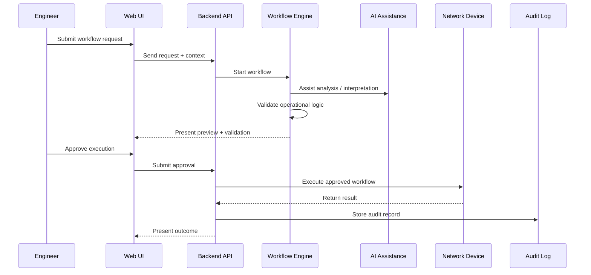

```mermaid
sequenceDiagram
    participant U as Engineer
    participant UI as Web UI
    participant API as Backend API
    participant WF as Workflow Engine
    participant AI as AI Assistance
    participant DEV as Network Device
    participant AUD as Audit Log

    U->>UI: Submit workflow request
    UI->>API: Send request + context
    API->>WF: Start workflow
    WF->>AI: Assist analysis / interpretation
    WF->>WF: Validate operational logic
    WF-->>UI: Present preview + validation
    U->>UI: Approve execution
    UI->>API: Submit approval
    API->>DEV: Execute approved workflow
    DEV-->>API: Return result
    API->>AUD: Store audit record
    API-->>UI: Present outcome
```
