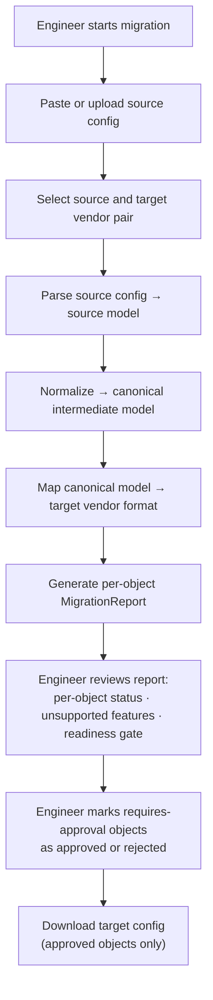

# Config Migration Workspace Workflow

## Overview

The Config Migration Workspace provides a deterministic, read-only firewall configuration translation tool. Engineers paste or upload a source firewall configuration, select a target vendor platform, and receive a structured migration report with per-object translation results, a readiness gate, and a downloadable target configuration.

Migration output is a reviewable preview. No changes are pushed to any device as part of this workflow.

This workflow is **READ_ONLY**. It does not connect to live devices, stage changes, or create change requests. Promoting a migration recommendation into a production change is a separate, deliberate step through the normal change pipeline.

---

## Supported Migration Pairs

| Source | Target | Status |
|---|---|---|
| Cisco ASA | Fortinet FortiOS | ✅ Implemented |
| Fortinet FortiOS | Palo Alto Networks PAN-OS 11.2 | ✅ Implemented |

Additional source and target vendor pairs are planned for future development.

---

## Workflow Goal

Translate a source firewall configuration into a target vendor format using a deterministic pipeline, producing:

- a per-object migration report with translation confidence classification
- explicit identification of objects that require operator review, remediation, or cannot be translated
- a downloadable target configuration ready for operator review and staged deployment
- a readiness gate summarising overall migration confidence

---

## Public Workflow Model

---

## Translation Pipeline

The migration engine operates as a deterministic, pure translation pipeline with no device I/O. The pipeline has three stages.

### 1. Parse
The source configuration is tokenized and parsed into a structured source model. The parser handles vendor-specific syntax, block structure, and implicit defaults.

### 2. Normalize
The source model is translated into a vendor-neutral canonical intermediate representation. This intermediate model captures the intent of the source configuration — interfaces, zones, addresses, address groups, services, service groups, security policies, NAT rules, routes, and VPN tunnels — in a form that is independent of both source and target vendor syntax.

This canonical model is the translation boundary: source vendors write to it, target vendors read from it. Source and target parsing are fully isolated and share no logic.

### 3. Map
The canonical model is rendered into target vendor format. Each object in the canonical model produces a translation result with a mapping status and, where applicable, a downloadable configuration fragment.

---

## Mapping Status Classification

Every translated object receives a mapping status. This classification drives the readiness gate and determines what appears in the downloadable target config.

| Status | Meaning |
|---|---|
| `auto_mapped` | High confidence translation. No operator review required before use. |
| `requires_approval` | Translation is complete but the operator should review before deploying. Common for derived objects (e.g. zones inferred from interface assignments) or constructs with behavioral differences between platforms. |
| `requires_remediation` | Translation is partial or incomplete. The operator must address the noted issues before the object can be deployed safely. |
| `blocked` | Cannot be translated. The object is surfaced in the unsupported features list with a severity classification and explanation. |

---

## Readiness Gate

The overall migration readiness is summarised as one of three states:

| State | Meaning |
|---|---|
| `ready` | All objects are `auto_mapped` or `requires_approval` with no blocked items. |
| `review_required` | One or more objects require operator approval or remediation before deployment. |
| `blocked` | One or more objects cannot be translated and must be handled manually before the migration can proceed. |

The readiness gate gives engineers a quick top-level signal about migration confidence before reviewing individual objects.

---

## Operator Review for Requires-Approval Objects

Objects with `requires_approval` status require an operator decision before they are included in the downloadable target configuration. Within the workspace, engineers can mark each such object as:

- **approved** — include in the downloadable config
- **rejected** — exclude from the downloadable config

This review state is held in the workspace session only. It is not persisted to the platform database and is not a change request — re-running the migration clears it. The intent is to give engineers a structured review pass before generating a config file, not to replace the formal change approval process.

---

## VPN Tunnels

VPN tunnel configuration is parsed and reported but is not auto-translated to the target platform. VPN tunnels always receive a `blocked` or `requires_approval` status with an explicit note that manual reconfiguration on the target platform is required. This reflects the operational reality that VPN configuration involves shared-secret management, peer coordination, and platform-specific lifecycle steps that cannot be safely automated as part of a config translation.

---

## FortiOS → PAN-OS Specifics

The FortiOS to PAN-OS migration path includes handling for constructs that have no direct equivalent on the target platform.

**Application Control and App-ID translation:** FortiOS Application Control profiles associated with security policies are pre-processed before mapping. Named application entries are promoted directly onto the referencing policy where a PAN-OS App-ID equivalent can be identified. Application entries that cannot be resolved to a PAN-OS App-ID are flagged as `requires_remediation`. Custom application signatures — which have no portable equivalent — are classified as `blocked`.

**NAT form equivalence:** FortiOS Central NAT and policy-based NAT are normalized to the same canonical representation, so both forms translate through the same PAN-OS NAT mapping path.

**Intrazone traffic behavior:** FortiOS and PAN-OS have different default behaviors for intrazone traffic. The migration report includes an explicit notice about this difference, classified as `requires_approval`, so engineers are aware of the behavioral change before deploying the translated policy.

---

## Download Options

The downloadable target configuration is generated at download time based on the engineer's review decisions.

**FortiOS target:** A flat-file FortiOS CLI configuration (`.conf`) with grouped address objects, Central NAT tables, and security policies. A JSON report payload is included alongside.

**PAN-OS target:** A PAN-OS 11.2 XML configuration file (`.xml`) importable via the platform's partial config load mechanism. The file groups entries by section (zones, address objects, address groups, service objects, service groups, NAT rules, security policies, static routes). A leading comment block documents every non-live item — blocked objects, objects requiring remediation, App-ID references, and pending or rejected review decisions — so no unreviewed configuration is emitted as live config.

Both formats include a header block carrying metadata: source vendor, target vendor, run date, readiness state, and review decision counts.

---

## Operational Safety

This workflow is READ_ONLY. The migration workspace:

- accepts config text as input only — no live device connections are made
- produces a report and a downloadable config file as output
- never creates a change request, change plan, or approval gate
- never pushes configuration to any device

The downloadable target configuration is a starting point for a planned migration, not a deployable artifact that can be applied without engineer review. Objects flagged as `requires_approval` or `requires_remediation` require deliberate operator action. Promoting any part of the migration output into a production change should follow the normal change workflow with deterministic validation, risk assessment, and human approval.

---

## Public Repository Scope

This public workflow example intentionally excludes:

- proprietary parser and normalizer implementation
- canonical intermediate model schema detail
- target vendor rendering and mapping logic
- App-ID translation table contents
- backend engine and sidecar architecture
- implementation-specific intellectual property

The purpose of this document is to demonstrate deterministic migration methodology, canonical-model-as-intermediate design, per-object confidence classification, and READ_ONLY operational classification in a complex translation workflow context.
