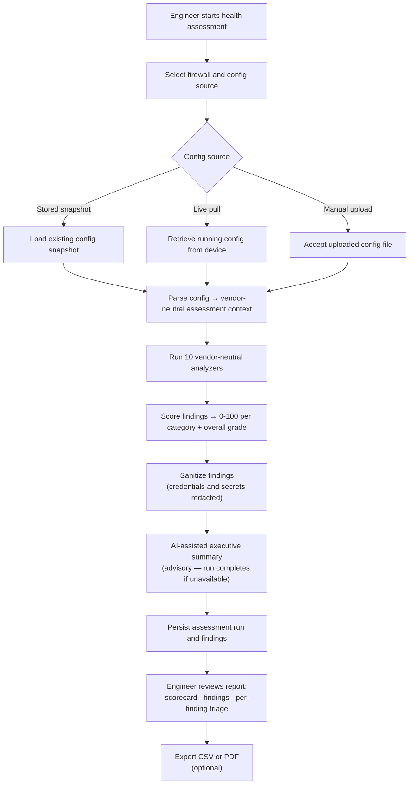

# Firewall Health Assessment Workflow

## Overview

The Firewall Health Assessment workflow performs a structured, read-only security and operational posture evaluation of a firewall configuration. It produces a scored report with per-finding detail, an AI-assisted executive narrative, and export options for documentation and client reporting.

Health assessments are designed to surface configuration risk, operational hygiene gaps, and security exposure across a standardised set of assessment categories — providing engineers with a repeatable, evidence-based view of firewall posture that is consistent across vendor platforms.

This workflow is **READ_ONLY**. It does not modify device configuration, stage changes, or create change requests of any kind.

---

## Supported Vendors

| Vendor | Platform |
|---|---|
| Fortinet | FortiGate (FortiOS 7.2.x, 7.4.x, 7.6.x) |
| Palo Alto Networks | PAN-OS 11.2.x |

Assessment output structure and scoring methodology are consistent across vendors. Vendor-specific checks are encapsulated within the assessment engine and are not exposed to the engineer as vendor-specific branches.

---

## Workflow Goal

Produce a structured, scored security and operational posture report for a firewall configuration that:

- identifies and classifies configuration findings by severity and category
- provides a scored summary (0–100, A–F grade) with per-category breakdowns
- supports engineer review, finding triage, and remediation prioritisation
- generates documentation-ready output for internal review or client reporting

---

## Config Source Options

An assessment can be run against three configuration sources. The engineer selects the appropriate source at run time.

| Source | Description |
|---|---|
| Stored snapshot | Assess the most recent (or a selected) configuration snapshot already held in the platform |
| Live pull | Retrieve the current running configuration from the device immediately before assessment |
| Manual upload | Upload a raw configuration file directly — no live device connectivity required |

The manual upload option supports assessments of firewalls that are not registered as live devices in the platform. This is useful for consultant engagements where only a configuration export is available, or for assessing devices in isolated environments.

---

## Public Workflow Model

---

## Assessment Categories

Findings are evaluated and scored across ten categories. Each category receives an independent score (0–100) and contributes to the overall grade via a weighted blend.

| Category | What it evaluates |
|---|---|
| Policy hygiene | Permissive rules, any-to-any policies, unused rules, rule ordering risks, shadow and duplicate rules |
| VPN configuration | Weak cryptographic proposals, deprecated algorithms, IKE version alignment, tunnel configuration risks |
| NAT consistency | NAT rule correctness, policy-based NAT conflicts, translation consistency |
| Object hygiene | Unused address and service objects, naming inconsistencies, object sprawl |
| Admin identity | Admin account configuration, default credentials, privilege separation |
| Management exposure | Management service accessibility, allowed management source networks, exposure to untrusted interfaces |
| Logging coverage | Log action configuration per policy, logging completeness, log forwarding configuration |
| Network segmentation | Zone design, inter-zone policy permissiveness, segmentation gaps |
| Platform posture | Firmware version, known platform-level configuration risks |
| Executive | Top-level posture summary across all categories |

---

## Scoring Model

Each category produces a score from 0 to 100. Scores reflect severity-weighted finding deductions — a single critical finding has a proportionally larger impact than several low-severity findings. Categories are additionally capped based on the worst severity present: a critical finding prevents a category from scoring above a defined ceiling regardless of how many clean checks pass.

The overall score is a weighted blend across security, operational, technical debt, and hygiene dimensions. Each dimension draws from relevant assessment categories.

Letter grades map as follows:

| Grade | Score range |
|---|---|
| A | 90 – 100 |
| B | 80 – 89 |
| C | 70 – 79 |
| D | 60 – 69 |
| F | Below 60 |

---

## AI Assistance Role

AI assistance in this workflow is strictly limited to producing a plain-language executive narrative after the deterministic assessment completes.

The AI component receives a sanitized payload — severity counts, category scores, and a short list of top findings — and produces a written executive summary and remediation priority narrative. It never receives raw configuration data, device credentials, CLI output, or security-sensitive evidence.

**The AI layer does not:**
- detect findings
- assign severity
- calculate scores
- produce per-finding evidence
- make changes to device configuration

If the AI component is unavailable or returns an error, the assessment run completes successfully with no executive summary attached. All scored findings, per-category results, and per-finding evidence are produced entirely by the deterministic assessment engine.

---

## Finding Review Workflow

Each finding in an assessment run carries a review status. Engineers can triage findings directly within the platform:

- mark a finding as reviewed
- accept a risk (with a documented rationale)
- flag for remediation

Finding review state is persisted against the assessment run. It is not carried forward automatically to future runs — each assessment run is an independent snapshot of posture at a point in time.

---

## Scheduled Assessments

Assessments can be scheduled using a cron expression to run automatically at defined intervals. Scheduled runs use either a stored snapshot or a live pull as the config source — manual upload cannot be scheduled, as no operator is present to supply a file at run time.

Scheduled assessments are useful for tracking posture drift over time and detecting regressions between engineer-initiated reviews.

---

## Run Comparison

Each assessment run can be compared against the previous completed run for the same device. The comparison surfaces:

- new findings introduced since the last run
- findings resolved since the last run
- score changes per category

This delta view supports posture trend tracking and provides evidence of remediation progress.

---

## Fleet Overview

The platform provides a fleet-level overview aggregating the latest completed assessment run per registered device. The fleet view shows:

- total devices assessed
- average overall score across the fleet
- grade distribution
- total finding count across the fleet
- per-device scorecard with links into individual run reports

---

## Export Formats

Assessment results can be exported in two formats:

| Format | Contents |
|---|---|
| CSV | One row per finding: severity, category, title, affected object, remediation guidance, review status |
| PDF | Title block (device, vendor, run date, config source), scorecard, severity and category-health tables, AI executive summary (if present), findings table |

PDF export includes optional consultant fields — client name and project name — which appear in the report header. These fields are informational labels only and are not a multi-tenancy mechanism.

---

## Operational Safety

This workflow is READ_ONLY. The assessment engine:

- reads configuration from the selected source
- performs no live device queries beyond the initial config retrieval (for live pull)
- writes only to the platform's own assessment run and finding tables
- never creates a change request, change plan, or approval gate
- never stages, executes, or previews device configuration changes

Findings and remediation guidance produced by the assessment are inputs to an engineer's decision-making process. Any remediation should be planned, validated, and executed through a separate change workflow with deterministic validation and human approval.

---

## Public Repository Scope

This public workflow example intentionally excludes:

- proprietary assessment engine logic and analyzer implementation
- scoring rule definitions and pattern files
- internal AI prompt content and sanitization logic
- vendor-specific assessment adapter behavior
- backend service architecture and orchestration details
- implementation-specific intellectual property

The purpose of this document is to demonstrate assessment methodology, READ_ONLY operational classification, deterministic scoring design, and appropriate AI boundary design in an analytical workflow context.
