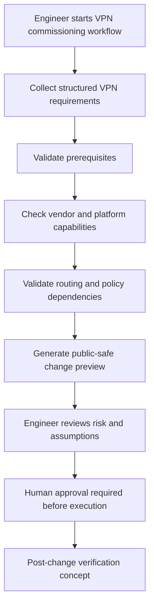

# Route-Based VPN Commissioning Workflow

## Overview

The Route-Based VPN Commissioning workflow is designed to help engineers plan and validate the creation of a site-to-site route-based IPsec VPN using a deterministic-first operational model.

Route-based VPN configuration is dependency-heavy. A complete implementation may involve interfaces, tunnel definitions, cryptographic settings, routing, firewall policies, NAT behavior, monitoring, and post-change verification.

This workflow demonstrates how Synapse Optical approaches complex operational changes: structured inputs, deterministic validation, vendor-aware checks, human approval, and audit-friendly change preview concepts.

---

# Workflow Goal

Assist engineers in preparing a validated route-based VPN change plan before production execution.

The workflow is intended to reduce configuration inconsistency, identify missing prerequisites, and improve the quality of pre-change review.

---

# Example Inputs

Typical workflow inputs may include:

- vendor platform
- device name
- tunnel name
- peer IP address
- local subnet or networks
- remote subnet or networks
- WAN interface or outside interface
- tunnel interface requirements
- IKE version
- Phase 1 proposal
- Phase 2 proposal
- Diffie-Hellman / PFS requirements
- routing requirements
- firewall policy requirements
- NAT exemption requirements

Where possible, workflow defaults should be derived from vendor-aware best-practice assumptions and validated against supported device capabilities.

---

# Public Workflow Model



---

# Deterministic Validation Areas

The workflow may validate the following areas before a change is approved.

## Device and Platform Context

- vendor platform
- operating system family
- supported VPN model
- supported API or management method
- known platform constraints

## Interface and Zone Requirements

- WAN / outside interface availability
- tunnel interface requirements
- zone or role assignment requirements
- interface naming conflicts
- existing tunnel reuse risks

## Cryptographic Compatibility

- IKE version
- Phase 1 proposal
- Phase 2 proposal
- Diffie-Hellman group
- PFS group
- weak or unsupported algorithm detection
- license or platform capability constraints

## Routing Dependencies

- local subnet validity
- remote subnet validity
- route conflict checks
- overlapping network detection
- next-hop or tunnel route assumptions

## Policy and NAT Dependencies

- required security policy direction
- source and destination zone assumptions
- NAT exemption requirements
- policy ordering considerations
- object naming consistency

## Operational Readiness

- existing tunnel conflicts
- duplicate peer IP detection
- missing prerequisite objects
- incomplete workflow inputs
- post-change verification requirements

---

# AI Assistance Role

AI assistance may be used to:

- explain validation warnings
- summarize change intent
- help interpret operational risk
- generate human-readable review notes
- assist with ticket documentation
- clarify missing requirements

AI does not directly generate uncontrolled production configuration or bypass deterministic validation.

---

# Example Change Preview Categories

A public-safe change preview may include:

- proposed tunnel purpose
- peer and network summary
- required dependencies
- validation warnings
- expected routing behavior
- expected policy behavior
- NAT considerations
- verification checklist
- rollback planning concept

---

# Example Review Summary

```text
Change type: Route-based site-to-site VPN

Summary:
This workflow prepares a route-based VPN between the selected local firewall and a remote peer. The proposed design requires a tunnel interface, compatible IKE/IPsec proposals, static or dynamic route handling, security policy updates, and NAT exemption validation.

Validation status:
No blocking prerequisite issues were identified in the available workflow context.

Review requirement:
Engineer approval is required before any production-impacting action.
```

---

# Post-Change Verification Concepts

After an approved implementation, verification may include:

- Phase 1 status
- Phase 2 status
- route installation
- traffic selector validation
- policy hit validation
- basic reachability testing
- tunnel stability observation
- audit record creation

---

# Human Approval and Operational Safety

Route-based VPN commissioning can affect production connectivity, routing behavior, and security policy enforcement.

For this reason, Synapse Optical is designed to keep deterministic validation and human approval at the center of this workflow.

The workflow should support engineers by improving consistency and visibility, not by removing operational accountability.

---

# Public Repository Scope

This public workflow example intentionally excludes:

- proprietary workflow orchestration logic
- internal AI prompts
- backend execution details
- vendor command templates
- generated configuration syntax
- rollback-generation implementation
- customer-specific network examples
- production-sensitive configuration data

The purpose of this document is to demonstrate deterministic workflow design, vendor-aware validation methodology, and safe AI-assisted operational thinking.
