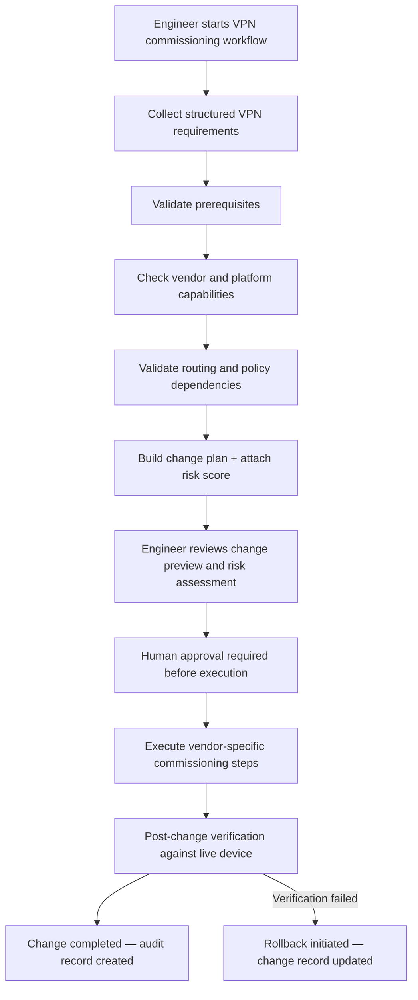

# Route-Based VPN Commissioning Workflow

## Overview

The Route-Based VPN Commissioning workflow helps engineers plan, validate, and execute the creation of a site-to-site route-based IPsec VPN using a deterministic-first operational model.

Route-based VPN configuration is dependency-heavy. A complete implementation involves interfaces, tunnel definitions, cryptographic settings, routing, firewall policies, NAT behavior, monitoring, and post-change verification. The dependencies and execution steps differ meaningfully between vendor platforms.

This workflow demonstrates how Synapse Optical approaches complex operational changes: structured inputs, deterministic validation, vendor-aware execution planning, human approval, and a structured post-change verification stage — with a full change lifecycle that tracks every state transition from submission through to completion or rollback.

---

## Workflow Goal

Assist engineers in preparing and executing a validated route-based VPN change across supported vendor platforms, while reducing configuration inconsistency, identifying missing prerequisites, and ensuring every stage of the change is auditable and reversible where supported.

---

## Example Inputs

Typical workflow inputs include:

- vendor platform
- device name
- tunnel name
- peer IP address
- local subnet or networks
- remote subnet or networks
- WAN interface or outside interface
- tunnel interface requirements
- IKE version
- Phase 1 proposal
- Phase 2 proposal
- Diffie-Hellman / PFS requirements
- routing requirements
- firewall policy requirements
- NAT exemption requirements

Where possible, workflow defaults are derived from vendor-aware best-practice assumptions and validated against the target device's known capabilities.

---

## Public Workflow Model



---

## Change Lifecycle

VPN commissioning is a **CHANGE_CAPABLE** workflow. Every commissioning request follows a mandatory lifecycle from submission through to completion or rollback. No execution occurs without explicit engineer approval.

```
pending_review → approved → executing → verifying → completed
               ↘ rejected
                             ↘ failed → rolled_back
                                          ↑
                                   (verifying → failed
                                    triggers rollback)
```

| Stage | Description |
|---|---|
| `pending_review` | Change plan generated, risk score attached, awaiting engineer review |
| `approved` | Engineer explicitly approved; execution may begin |
| `executing` | Vendor-specific commissioning steps being applied to the device |
| `verifying` | Post-execution checks running against the live device |
| `completed` | All verification checks passed; change confirmed live |
| `rejected` | Engineer rejected at review; no execution occurred |
| `failed` | Execution or verification failed; rollback initiated |
| `rolled_back` | Rollback completed; device returned to pre-change state where supported |

A risk score is calculated and attached to the change plan at `pending_review`, before the engineer makes the approval decision. The score is derived from declarative risk patterns evaluated against the proposed configuration — giving the approving engineer a signal about change sensitivity before execution begins.

---

## Deterministic Validation Areas

The workflow validates the following areas before a change plan is submitted for approval. Prerequisite findings are surfaced for engineer review; execution authority rests with the engineer through the approval gate.

### Device and Platform Context

- vendor platform
- operating system version
- supported VPN model
- supported API or management method
- known platform constraints and licensing requirements

### Interface and Zone Requirements

- WAN / outside interface availability
- tunnel interface requirements
- zone or role assignment requirements (vendor-specific)
- interface naming conflicts
- existing tunnel reuse risks
- vendor-specific object naming constraints

### Cryptographic Compatibility

- IKE version
- Phase 1 proposal
- Phase 2 proposal
- Diffie-Hellman group
- PFS group
- weak or unsupported algorithm detection
- license or platform capability constraints

### Routing Dependencies

- local subnet validity
- remote subnet validity
- route conflict checks
- overlapping network detection
- next-hop or tunnel route assumptions

### Policy and NAT Dependencies

- required security policy direction
- source and destination zone assumptions
- NAT exemption requirements
- policy ordering considerations
- object naming consistency

### Operational Readiness

- existing tunnel conflicts
- duplicate peer IP detection
- missing prerequisite objects
- incomplete workflow inputs
- post-change verification requirements

---

## Vendor Execution Model

The same normalized commissioning intent — tunnel name, peer address, proposals, networks — produces a different execution plan depending on the target vendor platform. The engineer interacts with one workflow; the platform handles the vendor-specific execution path.

### FortiGate

Commissioning steps are executed as CLI commands generated from vendor-specific templates, delivered over SSH with a REST API fallback for supported operations. The execution sequence covers interface creation, Phase 1 and Phase 2 configuration, static route, and firewall policy objects.

### Palo Alto Networks PAN-OS

Commissioning uses the PAN-OS XML API with a candidate-config lifecycle:

1. **Lock** — acquires an exclusive candidate configuration lock before any changes are staged
2. **Stage** — IKE crypto profile, IPsec crypto profile, address objects, IKE gateway, IPsec tunnel, outbound and inbound security policies, and static route are staged in the candidate config
3. **Validate and commit** — candidate config is validated, then committed atomically
4. **Discard on failure** — if any step fails, the candidate config is discarded and the lock is released, leaving the running config unchanged

The candidate-config lock model means an incomplete or abandoned session can block other configuration changes on the same device. The workflow manages lock acquisition and release explicitly.

PAN-OS enforces a 31-character limit on object names. The workflow applies name truncation where required to ensure generated object names are valid before the change plan is submitted.

> **Note:** VPN commissioning for both FortiGate and PAN-OS is currently implemented. Other vendor platforms are planned for future development.

---

## AI Assistance Role

For the VPN commissioning workflow, the change plan is built deterministically from structured engineer inputs. The AI layer is not involved in generating the commissioning plan or producing device commands.

AI assistance may be used for:

- prerequisite analysis (advisory warnings surfaced for engineer review — these never block execution)
- plain-language summaries of the proposed change and its dependencies
- explaining validation warnings
- assisting with ticket or change record documentation

Commands sent to devices are never generated by the AI. They are produced exclusively by vendor-specific templates validated against the target platform.

---

## Example Change Preview Categories

The change preview presented to the engineer before approval includes:

- proposed tunnel purpose and peer summary
- required dependencies and objects
- validation warnings
- risk score and risk factors
- expected routing behavior
- expected policy behavior
- NAT considerations
- post-change verification checklist
- rollback approach for this change

---

## Example Review Summary

```text
Change type: Route-based site-to-site VPN

Platform: FortiGate (FortiOS 7.4.x)

Summary:
This workflow prepares a route-based VPN between the selected local firewall
and a remote peer. The proposed change requires a tunnel interface, compatible
IKE/IPsec proposals, static route, security policy updates, and NAT exemption
validation.

Risk score: 0.35 / 1.0
Risk factors: New tunnel interface; requires outbound and inbound policy creation

Validation status:
No blocking prerequisite issues identified. Two advisory warnings raised:
- Confirm NAT exemption policy will not conflict with existing central SNAT rules
- Verify peer IKE version and proposal compatibility before execution

Review requirement:
Engineer approval is required before any production-impacting action.
Execution will not begin until approval is explicitly submitted.
```

---

## Post-Change Verification

Verification is a first-class lifecycle stage, not an optional check. After execution completes, the platform re-runs targeted verification commands against the live device for each changed resource.

Verification checks for a VPN commissioning change include:

- **Tunnel state** — Phase 1 and Phase 2 status re-verified against live device output
- **Route installation** — routing table queried to confirm the tunnel route is present
- **Policy visibility** — security policy list queried to confirm created rules are present
- **Object presence** — address and service objects confirmed present by name

Each check records whether it passed, a human-readable detail, and the raw device output captured at verification time. The full result is stored with the change record as a structured verification result — giving engineers an auditable confirmation of what succeeded or identifying the specific check that failed.

If verification fails after execution, the change transitions to `failed` and rollback is initiated where supported.

---

## Rollback and Failure Handling

Rollback behavior depends on the vendor platform and the type of operation.

**PAN-OS:** Because changes are staged in the candidate config before commit, a failure at any point before commit results in the candidate config being discarded automatically. The running config is never modified. This provides strong transactional safety for the commissioning sequence.

**FortiGate:** Rollback is tracked as part of the change record. The platform records the state before the change and the sequence of steps applied. Rollback for some FortiGate operations — including IPsec tunnel creation — requires operator confirmation rather than fully automated reversal, due to sequence number assignment by FortiOS at creation time. The change record documents what was applied and what would need to be reversed.

In both cases, the change record captures the pre-change state, execution steps, verification results, and final outcome — providing a complete audit trail regardless of whether the change succeeded or was rolled back.

---

## Human Approval and Operational Safety

Route-based VPN commissioning can affect production connectivity, routing behavior, and security policy enforcement.

Synapse Optical is designed to keep deterministic validation and human approval at the center of this workflow:

- No device commands are generated or executed without passing through structured validation
- A risk score is attached to every change before it reaches the approval stage
- No execution begins until an engineer explicitly approves the change
- Every state transition — submission, approval, execution, verification, completion, rollback — is logged to the audit record with operator attribution

The workflow supports engineers by improving consistency and operational visibility. It does not remove engineering judgment from the process.

---

## Public Repository Scope

This public workflow example intentionally excludes:

- proprietary workflow orchestration logic
- internal AI prompt design
- backend execution and template details
- vendor command and XPath generation
- rollback-generation implementation
- customer-specific network examples
- production-sensitive configuration data

The purpose of this document is to demonstrate deterministic workflow design, vendor-aware execution modeling, change lifecycle structure, and safe AI-assisted operational thinking.
