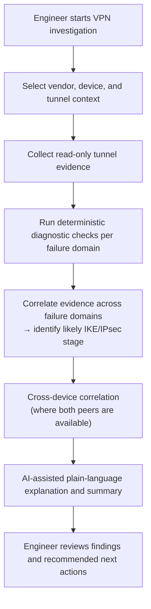

# VPN Tunnel Failure Investigation Workflow

## Overview

The VPN Tunnel Failure Investigation workflow is designed to help engineers investigate IPsec VPN issues using a structured, deterministic-first troubleshooting approach.

VPN failures are often caused by small mismatches across authentication, proposals, peer identity, NAT traversal, traffic selectors, routing, firewall policies, or device-specific behavior. This workflow provides a repeatable investigation model that helps reduce guesswork, improve troubleshooting consistency, and produce structured findings suitable for ticket documentation and escalation.

AI assistance is used to summarize findings and explain operational context. Deterministic evidence collection and structured diagnostic checks remain the primary mechanism for validation and root-cause analysis.

---

## Supported Vendors

Current proof-of-concept vendor support for this workflow:

| Vendor | Platform | Interaction Method |
|---|---|---|
| Fortinet | FortiGate (FortiOS 7.2.x, 7.4.x, 7.6.x) | REST API / SSH |
| Palo Alto Networks | PAN-OS 11.2.x | XML API / SSH |

Diagnostic evidence collection is normalized across vendors. The troubleshooting output structure is consistent regardless of the underlying platform.

---

## Workflow Goal

Help engineers identify the likely cause of a VPN tunnel failure by collecting evidence, validating known failure domains, and presenting a structured troubleshooting summary.

This workflow is intended for read-only investigation and operational analysis only. It does not modify device configuration, restart tunnels, clear sessions, or alter production state in any way.

---

## Example Inputs

Typical workflow inputs may include:

- vendor platform
- device name
- VPN tunnel name
- peer IP address
- approximate failure time
- local and remote networks, if known
- observed symptoms

Example symptoms:

- tunnel does not establish
- tunnel establishes but passes no traffic
- intermittent disconnects or tunnel flapping
- Phase 1 succeeds but Phase 2 fails
- tunnel drops after inactivity
- large packets dropped while small packets pass
- users report application reachability issues after tunnel shows as up

---

## Public Workflow Model



---

## Troubleshooting Stage Classification

Before evidence collection begins, the workflow classifies the investigation against known VPN failure stages. This allows deterministic checks to be targeted rather than exhaustive.

| Stage | Description | Common Indicators |
|---|---|---|
| Phase 1 — IKE negotiation | IKE SA cannot be established | No ISAKMP SA present, repeated negotiation attempts, proposal or peer ID rejection |
| Phase 2 — IPsec negotiation | IKE SA succeeds, IPsec SA fails | Phase 1 up, Phase 2 absent, traffic selector or proposal mismatch |
| Post-establishment — no traffic | Tunnel up but traffic not passing | Policy miss, NAT not exempted, selector mismatch, asymmetric routing |
| Post-establishment — instability | Tunnel established but unstable | DPD aggressive mode, rekey mismatch, SA lifetime drift, keepalive failure |
| Path and MTU | Tunnel functional but large packets fail | MTU too high, MSS clamping absent, PMTUD failure |
| Routing and reachability | Tunnel up, traffic passes, wrong path | Asymmetric routing, missing static route, overlapping address space |

Identifying the likely stage early narrows which diagnostic checks are most relevant and reduces unnecessary evidence collection.

---

## Deterministic Diagnostic Areas

The workflow collects and evaluates evidence across the following domains. Checks are vendor-normalized: the output structure is consistent regardless of whether the device is FortiGate or PAN-OS.

Diagnostic depth may vary depending on device access method and the log verbosity configured on the target device at the time of investigation. Where diagnostic evidence is unavailable, the workflow surfaces this explicitly rather than producing incomplete findings silently.

### Tunnel State

- Phase 1 SA presence and status
- Phase 2 SA presence and status
- tunnel uptime and last negotiation timestamp
- recent renegotiation or failure events
- SA count (expected versus actual)

### Authentication and Identity

- authentication method alignment between local and remote peers (pre-shared key versus certificate)
- peer identity type and value consistency (IP address, FQDN, distinguished name)
- certificate validity and chain indicators, where applicable
- user or group mapping, where applicable

### Proposal Compatibility — Phase 1 (IKE)

- IKE version (v1 versus v2 alignment)
- encryption algorithm
- hash and authentication algorithm
- Diffie-Hellman group
- IKE SA lifetime
- weak or deprecated algorithm detection

### Proposal Compatibility — Phase 2 (IPsec)

- encryption algorithm
- authentication algorithm
- PFS group (present on both sides or absent on both)
- IPsec SA lifetime (time and bytes)
- encapsulation mode (tunnel versus transport)

### Traffic Selectors and Proxy-ID Alignment

Traffic selector and proxy-ID mismatch is one of the most common Phase 2 failure causes in multi-vendor environments. FortiGate route-based VPNs use 0.0.0.0/0 selectors by default; PAN-OS requires explicitly configured proxy-IDs. Cross-vendor deployments require careful selector alignment.

Checks include:

- local subnet definition
- remote subnet definition
- proxy-ID configuration presence and correctness (PAN-OS)
- selector overlap or gap detection
- traffic selector negotiation outcome

### NAT Traversal and DPD

- NAT-T detection and UDP 4500 encapsulation status
- NAT-T configuration alignment between peers
- Dead Peer Detection mode (on-demand, on-idle, aggressive)
- DPD interval and retry settings alignment
- keepalive behavior and timeout patterns
- intermittent disconnect correlation with DPD timer values

### Routing and Path Reachability

- static route presence for remote subnets
- route installation after tunnel establishment
- overlapping or conflicting route detection
- asymmetric path indicators (tunnel up, return path differs)
- next-hop or tunnel interface binding

### Firewall Policy and NAT

- security policy path visibility (inbound and outbound)
- NAT exemption rule presence and correctness
- source and destination zone alignment
- policy ordering concerns
- hit count indicators where available

### MTU and Path Characteristics

MTU issues are a common post-establishment failure cause, particularly over MPLS paths, cloud interconnects, or double-encapsulated tunnels. A tunnel may show as fully established while silently dropping packets above a certain size.

Checks include:

- tunnel interface MTU configuration
- MSS clamping presence
- PMTUD behavior indicators
- symptom correlation (small packets pass, large packets fail)
- fragmentation indicators

---

## Cross-Device Correlation

Where both VPN peers are available within the platform, the workflow can run diagnostic evidence collection against both devices concurrently and correlate findings across peers.

Cross-device correlation surfaces mismatches that are not visible when examining a single device in isolation — for example, a Phase 1 proposal configured correctly on one peer but with a non-matching setting on the other. Each peer may report the tunnel as negotiating or failing without identifying the specific incompatibility from its own perspective alone.

Correlation output identifies:

- configuration mismatches between peers
- asymmetric DPD or keepalive settings
- selector or proxy-ID disagreements
- proposal version or algorithm divergence
- asymmetric NAT-T behavior

Cross-device correlation is read-only. No changes are made to either device during this process.

---

## AI Assistance Role

AI assistance is used after deterministic evidence collection and structured diagnostic checks are complete. It does not drive the investigation or make operational decisions.

AI assistance may be used to:

- convert raw diagnostic evidence and log output into a structured, plain-language summary for ticket documentation and escalation
- explain the likely failure stage based on collected evidence
- highlight missing diagnostic information that would improve investigation confidence
- suggest safe, read-only follow-up checks appropriate to the identified failure stage
- surface relevant vendor-specific context during analysis

All AI output is advisory. AI recommendations require engineer review and validation before any remediation action is considered. AI does not execute changes, modify device state, restart tunnels, or make autonomous operational decisions.

---

## Evidence Availability Note

Diagnostic depth is dependent on what evidence is available from the target device at the time of investigation.

Factors that may limit evidence collection include:

- log verbosity level configured on the device
- whether IKE debug output has been captured
- device access method (REST API versus SSH) and available diagnostic surface
- log retention window on FortiAnalyzer or the device itself
- whether the failure is active or historical

Where evidence is incomplete or unavailable, the workflow reports this explicitly. Confidence levels in the investigation output reflect the completeness of available diagnostic evidence — not a probabilistic AI estimate.

---

## Example Output Categories

The workflow output may include:

- investigation summary
- likely failure stage (with classification rationale)
- supporting evidence collected
- cross-device mismatch findings (where applicable)
- possible root causes in order of likelihood
- missing information (explicitly listed, not silently omitted)
- recommended read-only follow-up checks
- confidence level (reflects completeness of available diagnostic evidence, not probabilistic AI certainty)
- operational notes formatted for ticket documentation

---

## Example Result Summary

```text
Likely failure stage: Phase 1 negotiation

Summary:
The tunnel appears to be failing during initial IKE negotiation. The available evidence
suggests a proposal or peer identity mismatch rather than a routing or selector issue.
Phase 1 SA is absent on both peers. No Phase 2 negotiation has been attempted.

Supporting evidence:
- No active IKE SA found on local device
- Peer identity type: IP address (local) — FQDN (remote, inferred from log)
- Phase 1 proposals partially overlap but DH group differs across peers

Missing information:
- Remote peer log output not available for cross-device confirmation
- IKE debug not active; proposal rejection detail not captured

Recommended next action:
Confirm the configured IKE proposal, peer identity type, and DH group on both VPN peers
before making any configuration changes. Consider enabling IKE debug temporarily on the
local device to capture the specific rejection reason.

Confidence: Medium — local evidence sufficient for stage classification;
cross-device confirmation would increase certainty.
```

---

## Human Review and Operational Safety

This workflow is designed as a troubleshooting aid for engineering teams.

It does not automatically change firewall configuration, restart VPN tunnels, clear IKE or IPsec SAs, modify routing tables, or alter production state in any way.

Investigation findings are presented to the engineer for review. Any remediation should be evaluated by a qualified engineer, approved through the appropriate change process, and handled through a separate change workflow with deterministic validation and human approval gates.

---

## Post-Investigation Actions

After completing an investigation, recommended next steps depend on the identified failure stage:

- **Phase 1 failures:** Confirm proposal alignment and peer identity configuration on both peers before making changes. Use IKE debug output to capture the specific rejection reason.
- **Phase 2 / selector failures:** Verify traffic selector or proxy-ID configuration on both peers. In cross-vendor environments, confirm whether the remote peer expects explicit proxy-IDs.
- **Post-establishment / no traffic:** Validate NAT exemption rules, security policy direction, and route table state. Check for asymmetric routing indicators.
- **MTU / path issues:** Test with reduced packet sizes to confirm MTU-related behavior. Review tunnel interface MTU and MSS clamping configuration.
- **DPD / instability:** Review DPD mode and timer alignment across peers. Check for SA lifetime drift or aggressive rekey behavior.

All remediation actions should be reviewed and executed through an approved change workflow, not applied directly as an ad-hoc fix.

---

## Public Repository Scope

This public workflow example intentionally excludes:

- proprietary diagnostic logic and evidence collection implementation
- backend orchestration and service architecture details
- internal AI prompts or LLM orchestration flows
- vendor command mappings and diagnostic command sets
- implementation-specific parser behavior
- cross-device correlation engine internals
- production execution logic
- customer-specific configurations or real network examples

The purpose of this document is to demonstrate operational methodology, deterministic troubleshooting structure, vendor-normalized diagnostic design, and AI-assisted engineering workflow thinking.
