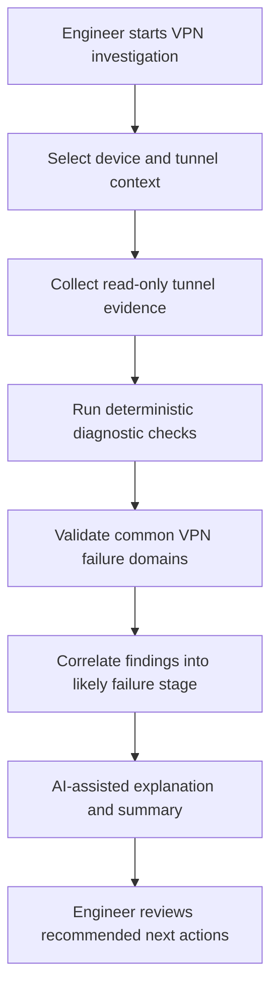

# VPN Tunnel Failure Investigation Workflow

## Overview

The VPN Tunnel Failure Investigation workflow is designed to help engineers investigate IPsec VPN issues using a structured, deterministic-first troubleshooting approach.

VPN failures are often caused by small mismatches across authentication, proposals, peer identity, NAT traversal, routing, selectors, firewall policies, or device-specific behavior. This workflow provides a repeatable investigation model that helps reduce guesswork and improve troubleshooting consistency.

AI assistance is used to summarize findings and explain operational context. Deterministic checks remain the primary mechanism for validation and evidence collection.

---

# Workflow Goal

Help engineers identify the likely cause of a VPN tunnel failure by collecting evidence, validating known failure domains, and presenting a structured troubleshooting summary.

This workflow is intended for read-only investigation and operational analysis.

---

# Example Inputs

Typical workflow inputs may include:

- vendor platform
- device name
- VPN tunnel name
- peer IP address
- approximate failure time
- local and remote networks, if known
- observed symptoms

Example symptoms:

- tunnel does not establish
- tunnel establishes but passes no traffic
- intermittent disconnects
- Phase 1 succeeds but Phase 2 fails
- tunnel drops after inactivity
- users report application reachability issues

---

# Public Workflow Model



---

# Deterministic Validation Areas

The workflow may validate the following areas depending on vendor platform and available evidence:

## Tunnel State

- Phase 1 status
- Phase 2 status
- tunnel uptime
- last negotiation state
- recent failure indicators

## Authentication and Identity

- peer identity alignment
- authentication method consistency
- certificate or pre-shared key indicators
- user or group mapping, where applicable

## Proposal Compatibility

- IKE version
- encryption proposal
- hash/authentication proposal
- Diffie-Hellman group
- PFS settings
- lifetime compatibility

## NAT Traversal and DPD

- NAT-T behavior
- Dead Peer Detection indicators
- source and destination ports
- keepalive behavior
- intermittent timeout patterns

## Routing and Selectors

- local subnet validation
- remote subnet validation
- proxy ID / traffic selector consistency
- route availability
- asymmetric path indicators

## Firewall Policy and NAT

- policy path visibility
- NAT exemption assumptions
- source and destination zone alignment
- policy ordering concerns

---

# AI Assistance Role

AI assistance may be used to:

- summarize diagnostic findings
- explain likely failure stages
- convert technical evidence into an engineer-readable summary
- highlight missing information
- suggest safe next diagnostic steps

AI does not directly execute changes or make production-impacting decisions.

---

# Example Output Categories

The workflow output may include:

- investigation summary
- likely failure stage
- supporting evidence
- possible causes
- missing information
- recommended read-only follow-up checks
- confidence level
- operational notes for ticket documentation

---

# Example Result Summary

```text
Likely failure stage: Phase 1 negotiation

Summary:
The tunnel appears to be failing during initial IKE negotiation. The available evidence suggests a proposal or peer identity mismatch rather than a routing or firewall policy issue.

Recommended next action:
Confirm the configured IKE proposal, peer identity, and authentication method on both VPN peers before making any configuration changes.
```

---

# Human Review and Operational Safety

This workflow is designed as a troubleshooting aid.

It does not automatically change firewall configuration, restart VPN tunnels, clear sessions, or modify production state.

Any remediation should be reviewed by an engineer and handled through an approved change workflow.

---

# Public Repository Scope

This public workflow example intentionally excludes:

- proprietary diagnostic logic
- backend orchestration details
- internal AI prompts
- vendor command mappings
- implementation-specific parser behavior
- production execution logic
- customer-specific configurations

The purpose of this document is to demonstrate operational methodology, deterministic troubleshooting structure, and AI-assisted engineering workflow design.
